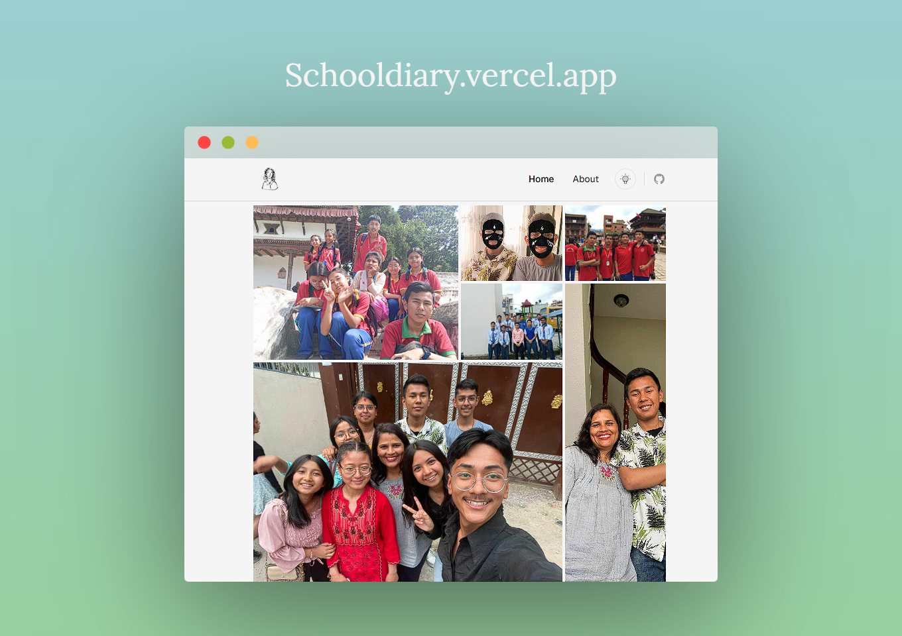

# School Diary

A visual gallery application for preserving school memories and moments.



## Overview

School Diary is a Next.js application that allows users to upload and view images in a gallery format. Built as a personal project to document school memories from Prashanti Academy.

## Tech Stack

- Next.js 15.3
- React 19
- TypeScript
- Tailwind CSS
- Firebase (Firestore & Storage)
- Radix UI

## Getting Started

### Prerequisites

- Node.js 22.x
- npm or yarn

### Installation

```bash
npm install
```

### Environment Variables

Create a `.env` file in the root directory:

```
NEXT_PUBLIC_FIREBASE_API_KEY=your_api_key
NEXT_PUBLIC_FIREBASE_AUTH_DOMAIN=your_auth_domain
NEXT_PUBLIC_FIREBASE_PROJECT_ID=your_project_id
NEXT_PUBLIC_FIREBASE_STORAGE_BUCKET=your_storage_bucket
NEXT_PUBLIC_FIREBASE_MESSAGING_SENDER_ID=your_sender_id
NEXT_PUBLIC_FIREBASE_APP_ID=your_app_id
NEXT_PUBLIC_FIREBASE_MEASUREMENT_ID=your_measurement_id
```

### Development

```bash
npm run dev
```

Open [http://localhost:3000](http://localhost:3000) in your browser.

### Build

```bash
npm run build
npm start
```

## Features

- Image gallery with masonry layout
- Image modal for full-size viewing
- Dark and light theme support
- Responsive design
- Firebase integration for storage and data


